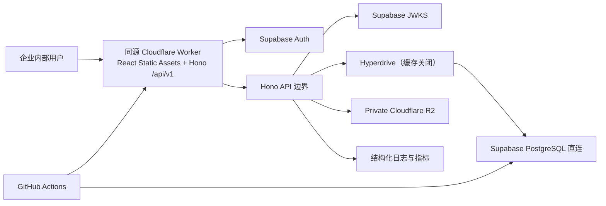
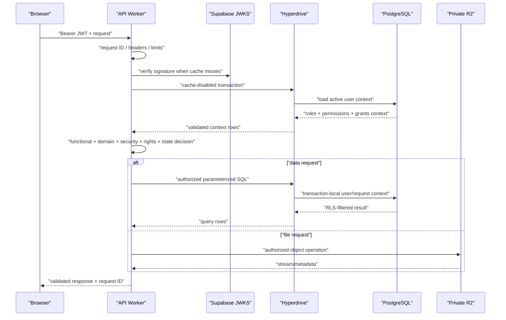

# Wison 油气知识平台 Technical Architecture

| 属性 | 内容 |
|---|---|
| 文档状态 | 已批准作为 Foundation Task 2 上游；不代表完整 G3/G4 |
| 版本 | 1.0 |
| 日期 | 2026-07-31 |
| 上游输入 | 已批准的 `docs/product/PRD.md` v1.1 与 `docs/product/system-design.md` v1.0 |
| 配套验收 | `docs/product/acceptance-criteria.md` |
| 架构范围 | React Web、版本化 API、Supabase PostgreSQL/Auth、私有 R2、Cloudflare 运行与交付 |
| 批准依据 | Hank 授权的一致性修正；独立架构复审 PASS；2026-07-31 |

## 1. 决策摘要

本项目采用一套可增量交付的托管架构：

- `apps/web`：React + TypeScript + Vite 单页应用，构建为 Cloudflare Worker 的静态资产。
- `apps/api`：独立工作区边界内的 Hono + TypeScript Worker 入口，处理同源 `/api/v1`；它不是第二个生产 Worker，而是与 Web 静态资产组成一个版本化部署制品。
- `packages/contracts`：Zod runtime schema 与推导 TypeScript 类型的唯一共享契约包。
- Supabase Auth：内部账号与会话；生产使用非对称签名 JWT。
- Supabase PostgreSQL：结构化主数据、关系、权限、工作流、全文检索元数据和审计的唯一主库；Worker 通过 cache-disabled Cloudflare Hyperdrive 直连。
- Cloudflare R2：报告附件、受控资产和导出制品的私有对象存储。
- GitHub 中现有 JSON、Excel、HTML 和脚本：只作为迁移输入、视觉参考或历史证据，不作为生产主数据。

该架构实现 PRD 所需的内部产品，但不在 Foundation 分支实现公司、项目、报告、搜索、导入、通知、生产部署、向量或 AI 功能。

## 2. 架构边界



### 2.1 信任边界

- 浏览器是不可信客户端；展示层权限不能替代 API 授权。
- 同源 Worker 的 `/api/v1` 路由是业务互联网入口与主要授权执行点；静态资产不携带权限决定。
- PostgreSQL RLS 是纵深防御，不替代 API 的动作授权。
- R2 bucket 永不公开；对象键不能视为授权凭据。
- 迁移和后台任务使用独立服务身份，不复用普通用户身份。
- 生产秘密只存在于部署平台的 secret/受控 CI 环境，不进入前端、仓库、构建产物、日志或错误响应。

## 3. 仓库与依赖结构

```text
apps/
├── web/                 React SPA
└── api/                 Cloudflare Worker API
packages/
└── contracts/           Zod schemas and inferred types
supabase/
├── migrations/          Ordered SQL migrations
└── tests/               pgTAP/data-policy tests
tests/                   Workspace and cross-package tests
e2e/                     Browser smoke and later domain journeys
docs/                    Product, design, architecture, roadmap and plans
```

依赖方向只能是：

```text
web ───────► contracts ◄────── api
                              │
                              ├──► Hyperdrive/PostgreSQL adapter
                              └──► R2 adapter
```

`contracts` 不依赖 Web、API、数据库客户端或 Cloudflare 类型。业务域不得从 Web 导入 API 内部文件，也不得从 API 导入页面代码。

## 4. 运行时与工具链

### 4.1 已批准基线

| 项目 | 决策 |
|---|---|
| 本地/CI Node | 精确使用 Node `22.23.2` |
| `engines.node` | `>=22.22.2 <23`，与锁定依赖的最低要求一致 |
| npm | `10.9.8`；根清单通过 `packageManager` 记录 |
| TypeScript | 严格模式；版本由 lockfile 固定 |
| 包管理 | npm workspaces；提交 `package-lock.json`；CI 使用 `npm ci` |
| Worker 兼容日期 | 每次架构/依赖升级显式评审并由配置固定，不使用隐式“最新” |

Task 1 当前的 `>=22 <23` 与 `.nvmrc` 的 `22` 过宽：锁定的 `jsdom` 需要至少 Node 22.22.2，Vite 相关工具也要求较新的 Node 22。Task 2 前必须先用测试固定 `.nvmrc`、engine 和 `packageManager`，重新执行 frozen install 与 workspace tests。

### 4.2 依赖治理

- 不使用浮动 CDN 脚本、运行时 Google Fonts 或不稳定境外地图瓦片。
- 新依赖必须有明确用途、许可和维护状态；优先复用现有依赖。
- 依赖升级单独提交，必须通过类型、测试、构建和安全检查。
- 前端 bundle、Worker bundle 和浏览器资源设预算；具体数值在性能测试方案批准时关闭。

## 5. Web 前端

### 5.1 技术栈

- React、TypeScript、Vite。
- TanStack Router 管理类型化路由和安全返回路径。
- TanStack Query 管理服务端状态、缓存、失效和重试。
- 可访问组件和样式建立在本地资产上；Foundation 不锁定额外组件库。
- ECharts 只在后续图表域按共享适配器引入。

### 5.2 职责

- 组合 Product/System Design 定义的页面、状态和旅程。
- 使用 `@wison/contracts` 在网络边界验证响应；不能只依赖编译时类型。
- 使用访问令牌调用 API；不向 API 发送刷新令牌。
- 对 401 清理会话并安全回到登录；对 403/404 遵循不泄漏设计。
- 缓存键必须包含影响结果的查询和身份上下文；撤权、退出和账号禁用时清除受限缓存。
- 不在浏览器中保存 Supabase secret key、R2 凭据或任何可绕过 API 的数据库凭据。

### 5.3 Cloudflare Web 交付

生产使用一个公司控制域名和一个 Cloudflare Worker 版本：React 构建产物作为 Static Assets，`/api/*` 通过 `assets.run_worker_first` 进入 Hono，其余导航使用 `single-page-application` fallback。`apps/web` 与 `apps/api` 仍保持独立包边界和测试，但一起发布、一起 smoke、一起回滚，避免 Web/API 契约版本错配。

唯一发布命令的依赖顺序固定为 `contracts declarations → web assets → Worker bundle/dry-run/deploy`。仓库只能有一个生产 Wrangler 入口配置，其 Static Assets 目录必须指向已构建的 Web 产物。在第一个可部署 shell 验收中，必须同时测试 SPA 深链 fallback、`/api/v1/health`、未知 `/api/v1/*` 的 JSON 404，以及 Web 资产与 API 使用同一 Worker 版本。

`run_worker_first` 只让 API 路径进入 Hono middleware；静态资产必须通过 Static Assets `_headers` 提供 CSP、`X-Content-Type-Options: nosniff`、Referrer-Policy 和 Permissions-Policy 等 Web 基线头。

Web 调用相对路径 `/api/v1/*`。生产默认不开放跨域业务 API；本地开发只允许明确的 localhost origin。身份仍使用 Bearer access token，不能因为同源而省略 API 鉴权。最终公司域名由企业 IT 在 G4 前批准，任何示例域名都不是承诺。

Cloudflare 官方当前支持 React/Vite SPA 通过 Workers Static Assets 部署，以 `single-page-application` fallback 处理客户端导航，并可用 `run_worker_first` 保证 `/api/*` 始终进入 Worker：[React + Vite on Workers](https://developers.cloudflare.com/workers/framework-guides/web-apps/react/)、[SPA routing](https://developers.cloudflare.com/workers/static-assets/routing/single-page-application/)。

## 6. API 架构

### 6.1 API 规则

- 所有产品 API 位于 `/api/v1`；`/api/v1/health` 是 Foundation 唯一公开业务无关端点。
- Hono 负责路由、中间件和 Web 标准响应。
- 每个输入在边界使用 Zod 或明确 schema 验证。
- 每个响应遵循共享契约；错误使用稳定 code、用户安全 message 和 request ID。
- 不把数据库错误、堆栈、SQL、对象键、内部权限或秘密返回给客户端。
- 读取操作默认幂等；产生副作用的批量发布、导出和任务操作在对应领域加入幂等键或状态机。

### 6.2 请求处理顺序



### 6.3 错误与请求 ID

Foundation 共享错误代码固定为：

- `BAD_REQUEST`
- `UNAUTHORIZED`
- `FORBIDDEN`
- `NOT_FOUND`
- `INTERNAL_ERROR`

`VALIDATION_ERROR`、`CONFLICT`、`RATE_LIMITED`、`SERVICE_UNAVAILABLE` 或其他领域错误只能由实际需要它们的后续 Task 通过受测试的契约变更加入，不能在 Foundation 中提前承诺。

`requestId` 使用正则 `^req_[A-Za-z0-9][A-Za-z0-9_-]{7,127}$`；不承诺具体 UUID/ULID 实现，但接受入站 ID 时必须先验证该格式和长度，防止日志注入。未知异常统一转为安全的 `INTERNAL_ERROR`。

## 7. 身份与授权

### 7.1 身份验证

- Web 使用 Supabase Auth 的批准内部登录方式；开放注册禁用。
- 生产项目必须使用非对称 JWT 签名密钥。
- API 使用 `jose` 和项目 JWKS 校验签名、`iss`、`aud`、`exp`、`sub` 和允许算法。
- JWKS 缓存不得长于供应商建议的窗口，并必须提供紧急清除路径；密钥轮换先等待分发再切换。
- 对 legacy HS256 项目不在 Worker 中分发共享 JWT secret；迁移到非对称密钥是生产前置条件。

Supabase 官方说明项目 JWKS 端点、非对称密钥验证与缓存/轮换约束，并建议使用成熟库验证：[Supabase JWT](https://supabase.com/docs/guides/auth/jwts)、[JWT signing keys](https://supabase.com/docs/guides/auth/signing-keys)。

### 7.2 用户上下文

JWT 只证明身份，不承载最终产品授权。Foundation Task 2 共享的 `UserContext` 只是已验证身份的最小平台投影：`userId`、`email`、显式 `roles` 和显式 `permissions`。它不表示完整的记录授权决策。API 在后续身份/数据库 Task 的每次受保护请求中还必须加载或安全缓存以下服务端内部上下文：

- 用户 ID、规范化邮箱。
- 账号状态。
- 已授予角色。
- 功能权限代码。
- 必要的团队/订阅上下文与授权版本。

账号状态枚举、团队成员、订阅/记录授权和上下文版本属于后续数据库与授权实现，不在 Task 2 的共享 schema 中猜测。后续 Task 必须通过新的受测试契约扩展，不得静默改变 Task 2 字段。

账号禁用、角色或记录授权改变后，缓存必须在已批准的短窗口内失效；高风险操作可强制重新加载。

### 7.3 授权交集

最终授权是以下条件的交集：

1. 有效身份和账号。
2. PRD v1.1 允许该角色执行动作。
3. 数据库显式授予相应功能权限。
4. 目标内容域和安全等级允许。
5. L3 的订阅/团队/用户授权或 L4 的明确记录授权存在。
6. 版权动作矩阵允许当前用途。
7. 记录生命周期状态允许。

`super_admin` 只自动获得系统管理权限；不得用“所有权限”种子或代码分支让其自动获得内容编辑、发布或 L3/L4 阅读权。需要兼任时，显式添加内容角色。

## 8. PostgreSQL 与数据访问

### 8.1 主数据原则

- Supabase-managed PostgreSQL 是唯一结构化生产主库。
- 所有 schema 变更使用仓库内有序 SQL migration；禁止只在控制台手改生产结构。
- UUID 是内部主键；slug/别名是可变业务标识。
- 受治理主记录优先软删除/归档，并保留版本与审计。
- 数据库时间统一存储为 UTC，界面按批准时区显示。
- 所有生产记录必须满足 PRD 治理字段约束才能发布。

### 8.2 Worker 访问方式

在线业务请求使用 Cloudflare Hyperdrive 连接 Supabase 的 PostgreSQL **Direct connection**，不连接 Supavisor/pooled endpoint，避免双重池化。驱动固定为 Cloudflare 建议的 `pg` (node-postgres)，在 lockfile 中锁定实现计划验证的精确版本，且不低于 Hyperdrive 当前支持基线。Worker 开启 `nodejs_compat`，每个请求建立并在 `finally` 中关闭短生命周期 client。只使用薄 repository，不引入会把业务规则隐藏在生成代码中的重量 ORM。

- 每个环境使用独立 Hyperdrive binding 和最小权限 runtime 数据库角色；runtime 角色不是表 owner、不能 DDL、不能绕过 RLS。
- Hyperdrive query caching 在所有产品请求中显式关闭。官方说明其默认缓存不会因写入自动失效；账号、权限、撤权和 read-after-write 不能接受该陈旧窗口。
- 每个受保护查询必须在同一 client、同一短事务中严格执行 `BEGIN → set_config('app.user_id', verifiedSub, true) → set_config('app.request_id', requestId, true) → query → COMMIT`，失败时 `ROLLBACK`。`verifiedSub` 只能来自已完整验证的 JWT `sub`；不得使用会跨连接残留的 session state，也不得在事务外执行受 RLS 保护的业务查询。
- PostgreSQL helper 使用 `current_setting('app.user_id', true)` 读取上下文；缺失、空值或畸形值返回 `NULL` 并默认拒绝，不抛出可被利用的详细错误。数据库测试必须证明 runtime role 不是 owner、没有 `BYPASSRLS`、受保护表启用/`FORCE ROW LEVEL SECURITY`，且 view 使用 invoker 权限或以等价方式不绕过 RLS。
- API 先执行产品动作授权，SQL 再按安全等级、订阅/记录授权和 RLS 过滤，形成独立纵深防御。
- 需要多表原子性的写入使用显式事务或经版本化的 PostgreSQL function；所有参数化，禁止字符串拼接 SQL。
- migration 使用独立 `app_migrator` 身份；受控后台任务使用独立最小权限身份，不复用 Web 用户或 runtime owner。
- 不允许前端直接访问业务表、Hyperdrive、R2 或 privileged function。
- 生产 Hyperdrive 到 Supabase 必须使用严格 TLS 和主机证书校验，不使用 `require_no_verify`；在 G4 前评审 Supabase network restrictions/允许的 Cloudflare 连接路径、凭据轮换和紧急撤销。

Cloudflare 的 Supabase 集成要求 Hyperdrive 使用数据库 direct connection，并建议 Worker 通过受支持 PostgreSQL driver 访问；Hyperdrive 即使关闭查询缓存仍提供连接池与快速连接：[Hyperdrive + Supabase](https://developers.cloudflare.com/hyperdrive/examples/connect-to-postgres/postgres-database-providers/supabase/)、[Hyperdrive query caching](https://developers.cloudflare.com/hyperdrive/concepts/query-caching/)。

### 8.3 数据完整性与性能

- 关系表以唯一约束防止重复，以外键和检查约束保护引用与枚举。
- 权限、发布和导入依赖的关键操作必须事务化。
- 列表采用稳定排序与 cursor/keyset 或经批准的分页方式；不得用无界查询返回 10,000+ 项目。
- 索引由真实查询和 `EXPLAIN` 证据驱动；不在 Foundation 预建业务域索引。
- RLS policy、授权 RPC 和迁移必须有 pgTAP/集成测试。

## 9. R2 私有文件架构

### 9.1 存储边界

- 每个环境使用独立私有 bucket。
- 对象键使用不可猜测的内部标识，不依赖原始文件名。
- PostgreSQL 保存对象键、校验和、大小、MIME、报告版本、安全、版权、扫描、提取和保留状态。
- 原始文件名只作为经过清洗的显示/下载元数据。
- 上传先进入隔离前缀/状态；未通过判断前不能预览、提取或发布。

### 9.2 访问流程

Foundation 使用 `ObjectStorage` adapter 封装 R2 binding。隔离对象使用独立 private bucket/binding，不只依赖与已发布文件共用 bucket 的前缀。报告领域的下载/预览流程为：

1. API 重新验证身份、功能权限、L3/L4 授权、版权动作和报告/附件状态。
2. API 通过 R2 binding 获取元数据或对象流。
3. API 仅对已批准安全 MIME allowlist 提供 inline 预览，并设置经验证的 `Content-Type`、`X-Content-Type-Options: nosniff`、限定 CSP 和 `Content-Disposition`。HTML、SVG、脚本或任何未知/活动类型只能作为 `attachment` 下载，不得在主应用 origin inline 执行。
4. L3/L4 下载/导出写入审计；权限撤回后的新请求立即失败。

受限附件预览使用独立 origin，或在不带 `allow-same-origin` 的 sandbox 中打开，并配置 CSP `sandbox`。L3/L4 预览、下载和范围读取响应至少使用 `Cache-Control: no-store, private`，不依赖浏览器缓存实现离线继续访问；每个新请求都重新鉴权。

基线不向浏览器暴露永久公共 URL，也不使用长时效 presigned URL。Cloudflare 明确指出 R2 presigned URL 是在过期前可重复使用的 bearer token，且不能用于 custom domain；因此它只可在未来经过风险评审后用于特定大文件动作，不能作为受限附件的默认授权层：[R2 presigned URLs](https://developers.cloudflare.com/r2/api/s3/presigned-urls/)。

## 10. 环境、配置与秘密

架构采用 `development`、`staging`、`production` 三个环境：

| 边界 | Development | Staging | Production |
|---|---|---|---|
| Web/API | 本地或开发 Worker | 独立 Cloudflare 环境 | 公司域名生产 Worker |
| Auth/DB | 本地 Supabase 或开发项目 | 独立 staging 项目 | 独立 production 项目 |
| R2 | 开发 bucket | staging bucket | production private bucket |
| 数据 | 合成/脱敏 | 生产等价脱敏样本 | 批准生产数据 |
| 凭据 | 本地 `.env`（不提交） | 环境 secret | 生产环境 secret |

环境选择必须显式，不得通过域名字符串猜测。生产数据不得复制到开发环境；用于性能或故障测试时必须按批准规则脱敏。

## 11. 可观测性与运营

- 每个请求记录 request ID、路由模板、状态、延迟和最小必要身份/授权结果；不记录 token、秘密或完整受限正文。
- 安全拒绝记录内部原因，但对用户返回安全错误。
- 后续业务域记录导入批次、后台任务、数据新鲜度、搜索零结果、附件处理和通知状态指标。
- 日志字段和错误代码版本化，支持按 request ID 关联 Web、Worker、数据库 RPC 和对象访问。
- 告警至少覆盖错误率、P95、身份/JWKS 异常、数据库/R2 失败、任务积压和数据新鲜度；阈值由 `PRD-O-09/10/14` 关闭。
- 生产发布必须有回滚版本、数据库恢复点、smoke 结果和责任人。Worker 回滚不会回滚 PostgreSQL/R2 状态；数据库变更必须使用 expand/contract、维持当前与前一应用版本（N/N-1）兼容，按“先兼容扩展 → 应用发布 → 验证 → 延后收缩”顺序执行。

## 12. 测试与交付门禁

### 12.1 自动化层次

| 层次 | 主要证据 |
|---|---|
| 共享契约 | Zod 正/负例、类型检查、声明构建 |
| Web | 组件状态、路由、可访问性和 API 契约测试 |
| API | 路由、中间件、错误、授权和 adapter 单元/集成测试 |
| PostgreSQL | migration、约束、RLS、RPC、数据质量与回滚测试 |
| R2 | 私有访问、元数据、撤权、范围读取和错误测试 |
| E2E | 真实 Web/API/Supabase/R2 的正向和拒绝路径 |
| 性能/安全 | 批准负载下 P95/错误率、越权、泄漏、文件与秘密检查 |
| 生产 | Cloudflare URL、企业网络、域名/TLS、监控、回滚和 smoke |

每个 Implementation Task 先写指定失败测试，确认预期 RED 后只实现当前范围；随后运行计划中的所有验证命令、提交并独立审阅。任何非预期失败命令都会停止当前 Task。

### 12.2 CI/CD

Pull request CI 使用精确 Node/npm 与 `npm ci`，依次运行 workspace 布局、类型、lint、单元测试、数据库测试、构建、依赖/秘密检查和适用的 E2E。生产部署不属于 Foundation Task 2，必须到路线图的加固/交付阶段并满足 G4。

## 13. 架构选择与替代方案

| 决策 | 选择 | 未选择及原因 |
|---|---|---|
| Web 托管 | Workers Static Assets | 继续把散落 HTML 当生产入口：无法形成统一权限与版本化产品 |
| Web/API 部署 | 同一 Worker 版本：Static Assets + Hono `/api/*` | 两个域名/独立部署：增加 CORS、契约错配和联动回滚成本 |
| API | Hono Worker 路由 | 浏览器直连主库：难以统一动作授权、审计和错误边界 |
| 在线数据库访问 | cache-disabled Hyperdrive → Supabase direct PostgreSQL | Supabase Data API：事务/RLS 上下文与复杂查询受 HTTP 抽象限制；无池直连：边缘连接成本高 |
| 结构化主库 | Supabase PostgreSQL | D1 作为主库：关系、迁移和未来检索路径受限 |
| 文件读取 | Worker 授权后经 R2 binding 流式返回 | 公共 bucket/永久 URL：不能满足撤权与审计 |
| 身份验证 | Supabase 非对称 JWT + JWKS | Worker 持有共享 JWT secret：轮换和泄漏风险更高 |
| 发布单元 | Web 与 API 同一版本发布和回滚 | 分开发布：容易让 SPA 与 API 契约跨版本错配 |

如果企业网络、数据驻留或运维要求否定当前供应商，必须在部署前重新批准架构；共享 REST/Zod 契约、版本化 PostgreSQL migrations 和对象存储 adapter 用于降低迁移到兼容 PostgreSQL 供应商的成本，不宣称数据库无关。

## 14. Task 1 一致性结论与修正要求

Task 1 的 workspace、包边界、严格 TypeScript、依赖分组和静态资产保护与本架构一致，也没有提前实现业务功能。Task 2 前的直接阻断问题是 Node/npm 声明范围过宽；另一个已登记的一致性缺口是 Task 1 的临时 build 脚本尚不能组装“Web assets + API”单 Worker 制品。后者不影响 Task 2 的纯 contracts 输出，但必须在首个可部署 Web/API shell Task 中以失败测试先行修正，不得延后到生产部署。

Task 2 前执行一个独立 TDD 修正：

1. 扩展 workspace 测试，使其先因 `.nvmrc`、engine 和 `packageManager` 不符合本架构而失败。
2. 将 `.nvmrc` 固定为 `22.23.2`。
3. 将 `engines.node` 改为 `>=22.22.2 <23`，并添加 `packageManager: npm@10.9.8`。
4. 使用 Node 22.23.2 运行测试、`npm ci --engine-strict` 和 `npm ls --all`。
5. 以单独提交保存并独立复审。

改写后的 Implementation Plan 还必须将单 Worker 制品修正绑定到首个同时具有 Web/API 资产的 Task：先构建 contracts 和 Web，再执行唯一 Wrangler dry-run，并测试 SPA/健康路由/API 404 的分流。

## 15. Foundation Task 2 架构边界

Task 2 可以且只能创建：

- contracts 包的 TypeScript/Vitest 配置。
- API health/error runtime schema 与类型。
- 六个角色、五个 Foundation 权限、安全等级、版权类型和用户上下文 runtime schema 与类型。
- 对契约正例、负例、未知值和超级管理员非隐式授权语义的测试。

Task 2 不得创建 API route、数据库 migration、R2 binding、React 页面或任何业务域 schema。Task 2 的权限列表是“可授予能力词汇”，不是角色默认授权表；实际角色—权限映射由后续受测试的 migration 建立。

Task 2 的固定技术词汇为：

| 类别 | 值 |
|---|---|
| 角色 | `sales_bd`、`research_admin`、`content_editor`、`content_reviewer`、`management_readonly`、`super_admin` |
| Foundation 权限 | `platform.access`、`admin.user.manage`、`admin.authorization.manage`、`admin.policy.manage`、`audit.read` |
| 安全等级 | `L1`、`L2`、`L3`、`L4` |
| 版权类型 | `OWNED`、`PUBLIC_THIRD_PARTY`、`LICENSED_RESTRICTED`、`DERIVED_REVIEW_REQUIRED` |

用户上下文允许空角色/空权限以表达默认拒绝；角色和权限不得重复。`super_admin` 加空权限解析后必须仍为空，schema 绝不根据角色推导权限。所有网络对象使用 strict runtime schema，拒绝未知字段、未知枚举、畸形时间和畸形 request ID。

Task 2 三个共享对象的 canonical shape 固定为：

```ts
type HealthResponse = {
  status: 'ok';
  service: 'api';
  version: string; // non-empty
  timestamp: string; // ISO 8601 datetime with UTC Z or an explicit offset
};

type ApiErrorCode =
  | 'BAD_REQUEST'
  | 'UNAUTHORIZED'
  | 'FORBIDDEN'
  | 'NOT_FOUND'
  | 'INTERNAL_ERROR';

type ApiErrorResponse = {
  error: {
    code: ApiErrorCode;
    message: string; // 1..500 characters, safe for clients
    requestId: string; // ^req_[A-Za-z0-9][A-Za-z0-9_-]{7,127}$
  };
};

type UserContext = {
  userId: string; // UUID
  email: string; // valid email, maximum 254 characters
  roles: Role[]; // may be empty; unique values only
  permissions: Permission[]; // may be empty; unique values only
};
```

以上四个字段集合均无可选字段，并通过 `z.strictObject` 拒绝额外字段。`timestamp` 使用 Zod 4 `z.iso.datetime({ offset: true })`；`UserContext` 不包含账号状态、团队、订阅、记录授权或上下文版本，这些属于后续受测试的服务端授权契约。

## 16. 架构批准条件

本文可作为 Foundation Task 2 的权威架构输入，当且仅当：

- Product/System Design 的对象、状态与权限结果均有明确实现边界。
- Task 1 Node 一致性问题已进入批准的修正 Task。
- 重写后的 Roadmap 和 Codex Implementation Plan 引用本文而不是旧混合设计。
- Task 2 明确保持 foundation-only。
- 独立审阅没有未关闭的 Critical 或 Important 问题。

本文批准不代表生产环境、供应商账号、域名、数据驻留、RPO/RTO 或完整 G3/G4 已验收。
