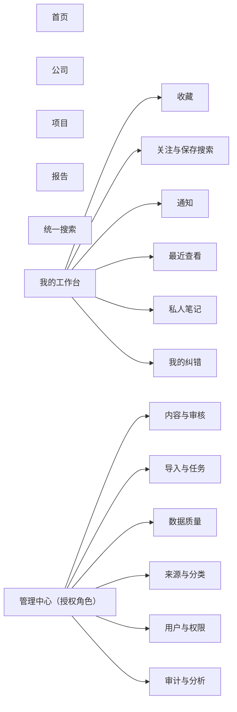
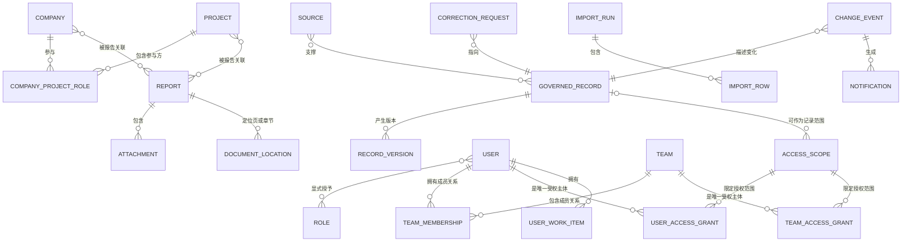
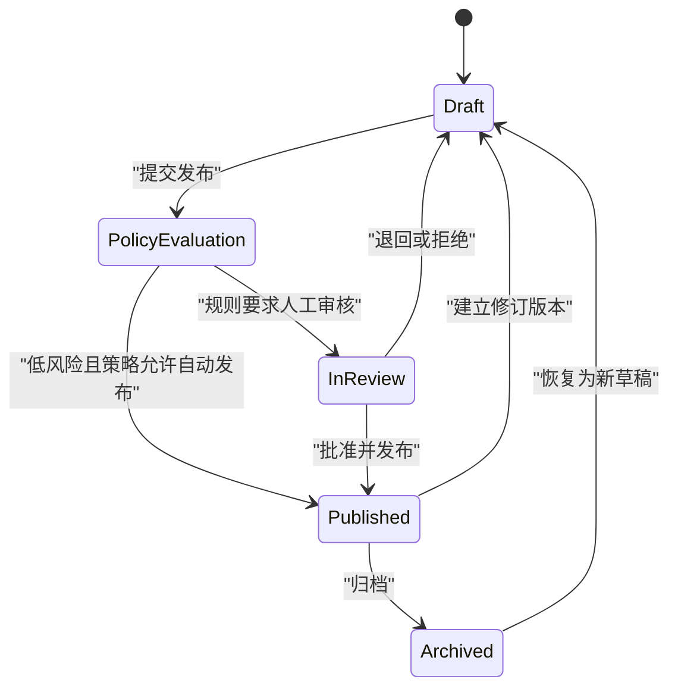
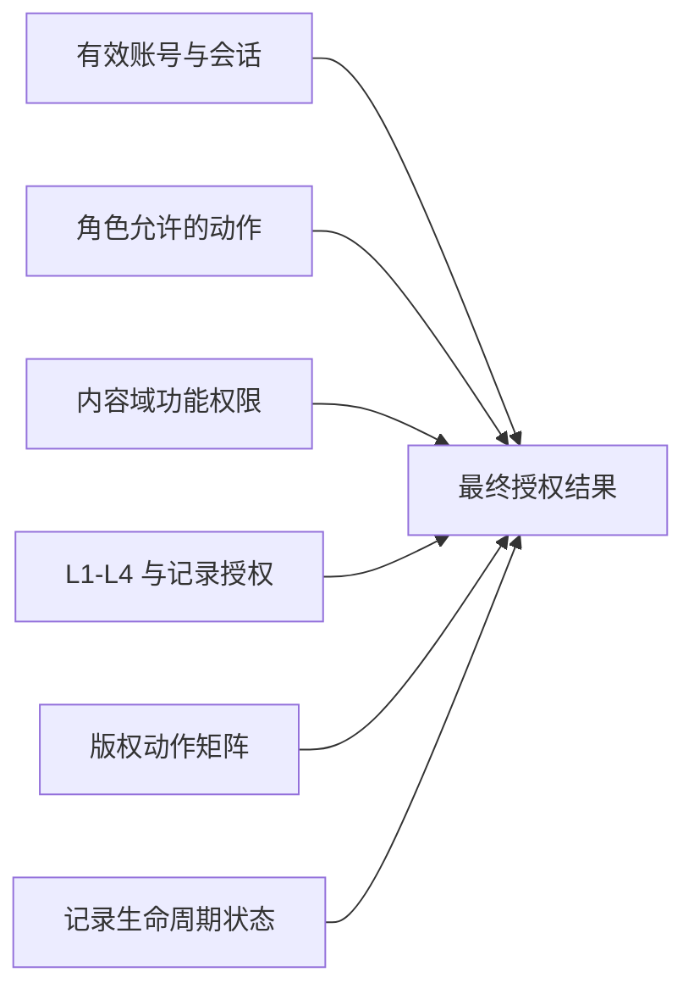

# Wison 油气知识平台 Product/System Design

| 属性 | 内容 |
|---|---|
| 文档状态 | 已批准作为 Foundation Task 2 上游；不代表完整 G2 |
| 版本 | 1.0 |
| 日期 | 2026-07-31 |
| 上游权威 | `docs/product/PRD.md` v1.1 |
| 配套验收 | `docs/product/acceptance-criteria.md` |
| 文档职责 | 页面与信息架构、业务对象关系、流程状态、权限结果和体验边界 |
| 批准依据 | Hank 授权的一致性修正；独立系统设计复审 PASS；2026-07-31 |

## 1. 权威边界

本文件只回答以下问题：

1. 页面和导航如何组织。
2. 用户如何完成 PRD 中的核心任务。
3. 公司、项目、报告、来源、用户工作流和治理对象如何关联。
4. 内容、导入、纠错和通知如何流转。
5. 权限结果如何在页面、对象和动作层表达。

本文件不得改变 `PRD-G-*`、`PRD-J-*`、`PRD-F-*`、`PRD-S-*` 或 PRD 第 10 节的产品规则。React 组件、API、数据库表、Cloudflare、PostgreSQL、R2、身份供应商和测试工具属于 Technical Architecture 或 Codex Implementation Plan，不由本文件决定。

旧文件 `docs/superpowers/specs/2026-07-30-oil-gas-knowledge-platform-design.md` 仅为历史输入。PRD v1.1 始终优先；本文件自上述批准记录后成为其下游系统设计权威，且不得覆盖 PRD。

## 2. 设计目标与原则

### 2.1 设计目标

- 一个入口完成公司、项目、报告和授权正文的发现与关联浏览。
- 让销售/商务用户以最短路径完成会前准备、机会发现和支撑材料查找。
- 让市场研究与内容角色在不修改代码的情况下完成草稿、审核、发布、纠错和数据质量处理。
- 在结果数量、片段、附件、导出和错误状态中一致执行权限，避免侧信道泄漏。
- 所有重要事实、文件使用和治理变化均能回到来源、版本、责任方和审计记录。

### 2.2 全局原则

1. **对象优先：** 公司、项目和报告是一级对象；新闻只作为来源或变化事件。
2. **关系可见：** 详情页必须显示与其他一级对象及来源的关系，不形成孤立档案。
3. **列表到证据：** 所有摘要、图表和结论都能进入记录详情或来源证据。
4. **权限先于呈现：** 页面不得先获取再隐藏无权数据；拒绝状态不得泄漏存在性或数量。
5. **治理伴随内容：** 来源、新鲜度、核验、版权、安全和版本不放入孤立后台，而在使用决策点可见。
6. **桌面任务优先：** 首发优化企业桌面环境，同时保证较窄桌面和放大场景可操作；不设计原生移动端。
7. **状态完整：** 每个页面都必须定义加载、空数据、零结果、错误、离线/重试、401、403 和 404 行为。
8. **渐进披露：** 默认呈现决策所需摘要，详细治理、历史和技术信息按需展开。

## 3. 信息架构与导航

### 3.1 一级导航

桌面端固定显示首页、公司、项目、报告、统一搜索和“我的工作台”。管理中心只在用户拥有至少一个管理能力时出现；隐藏入口不能替代服务端拒绝。

### 3.2 页面与路由清单

| 页面 | 建议路径 | 主要结果 | PRD 追溯 |
|---|---|---|---|
| 未登录入口 | `/login` | 企业身份入口、安全返回路径、无开放注册；禁用账号进入明确拒绝结果 | PRD-F-12 |
| 首页 | `/` | 全局搜索、近期变化、新报告、关注变化、收藏和新鲜度提示 | PRD-F-01 |
| 公司列表 | `/companies` | 搜索、筛选、排序、保存视图、授权导出 | PRD-F-02 |
| 公司详情 | `/companies/:idOrSlug` | 公司事实、项目、报告、指标、来源和变化历史 | PRD-F-02、PRD-J-01 |
| 项目列表/地图 | `/projects` | 同一筛选状态下切换列表和地图 | PRD-F-03 |
| 项目详情 | `/projects/:idOrSlug` | 参与方、里程碑、属性、报告、来源和历史 | PRD-F-03、PRD-J-02 |
| 报告列表 | `/reports` | 元数据/正文搜索、筛选、排序和分页 | PRD-F-04 |
| 报告详情 | `/reports/:id` | 元数据、结论、关系、治理、隔离预览和授权下载 | PRD-F-04、PRD-J-03 |
| 统一搜索 | `/search` | 分组结果、共享筛选、高亮、零结果恢复 | PRD-F-05 |
| 我的工作台 | `/workspace/*` | 收藏、关注、通知、最近查看、笔记、纠错 | PRD-F-06 |
| 内部分享入口 | `/share/:shareId` | 登录后重新鉴权并跳转到当前授权对象或明确拒绝 | PRD-F-06、PRD-F-09 |
| 管理中心 | `/admin/*` | 内容、导入、审核、数据质量、任务、用户和审计 | PRD-F-07、PRD-F-08、PRD-F-10 |

URL 中只保留可分享、可恢复的筛选与分页状态；不得放入访问令牌、原始权限信息、受限正文或秘密。

### 3.3 全局页面骨架

所有已登录页面共享：

- 产品标识、一级导航和用户菜单。
- 全局搜索入口。
- 页面标题、面包屑和可选对象操作区。
- 统一的来源/新鲜度提示组件。
- 统一通知入口和未读状态。
- 对拒绝、失效和重试使用一致语言的反馈区域。

列表页统一采用“查询摘要 → 筛选 → 排序 → 结果 → 分页/继续加载”的结构。详情页统一采用“对象摘要 → 关键关系/事实 → 证据与治理 → 历史 → 授权操作”的结构。

## 4. 核心页面设计

### 4.1 首页

首页从上到下包含：

1. 全局搜索及常用查询入口。
2. 与当前用户有关的关注变化和待处理通知。
3. 最近更新公司/项目与新发布报告。
4. 收藏和最近查看。
5. 数据新鲜度、异常或维护公告。

首页卡片只显示用户有权访问的对象；聚合数字也必须按相同权限过滤。市场价格摘要为可移除增强区，不阻断内部 MVP。

### 4.2 公司与项目

公司和项目列表共享筛选交互：

- 已应用筛选以可移除标签展示，并提供“一键清除”。
- 排序规则、结果数量口径和更新时间可见。
- 筛选可以保存为私人视图或关注条件。
- 列表、地图和导出使用同一查询快照，避免结果不一致。

公司详情的默认顺序是：身份与摘要、业务与区域、关键项目、近期变化、指标、相关报告、内部分析、来源与历史。

项目详情的默认顺序是：身份与状态、位置与容量、参与公司及角色、里程碑、技术属性、相关报告、来源与历史。

地图只是项目查询的另一种呈现，不是独立数据源。无坐标记录仍保留在列表，并说明无法显示在地图的原因。

### 4.3 报告与附件

报告列表必须在结果层显示标题、来源、日期、语言、核验状态和适用的安全提示。正文命中只返回已授权片段。

报告详情分为：

- 书目信息与版本。
- 摘要和关键结论。
- 相关公司、项目、标签和区域。
- 来源、版权、安全、核验与责任方。
- 一个或多个附件的状态、预览和下载入口。
- 提取状态、页/章节定位和失败说明。

附件预览在隔离区域打开，不取得主应用执行权限。被隔离、处理中、提取失败、权限已收回和源文件缺失分别使用不同状态，不以通用“加载失败”替代。

### 4.4 统一搜索

搜索结果按公司、项目、报告和授权正文分组，并可切换为单类型视图。每个结果解释名称/别名、字段或正文为何命中；高亮只来自允许返回的内容。

零结果分为：

- 查询无匹配。
- 筛选过窄。
- 当前权限下无可返回结果。
- 索引或服务暂时不可用。

为避免泄漏，产品不得区分“存在但无权访问”与“没有记录”；两者对普通用户使用相同的无授权结果表达，只保留受限审计信号。

### 4.5 我的工作台

工作台按对象或查询类型聚合个人记录：

- 收藏与最近查看始终在打开时重新鉴权。
- 保存搜索保存规范化条件，不保存当时的受限结果快照。
- 关注项可静音；失效或撤权对象显示不可访问状态并允许移除。
- 私人笔记默认仅本人可见；离职和保留规则仍由 `PRD-O-05` 关闭。
- 纠错请求显示字段、建议、来源、状态、处理人、决定和原因。

### 4.6 管理中心

管理中心按工作而非数据库表组织：

1. **内容队列：** 草稿、待审核、需复核、已发布、已归档。
2. **导入与任务：** 上传、模板识别、校验、重复候选、变化预览、发布和失败重试。
3. **纠错与审核：** 分配、比较、决定、版本和通知。
4. **数据质量：** 无来源、陈旧、重复、提取失败、关系异常和待复核。
5. **来源与分类：** 来源、标签、别名、分类和模板。
6. **通知治理：** 事件、去重、抑制、撤回和重处理。
7. **用户与权限：** 账号、角色和记录授权；只对超级管理员显示。
8. **审计与分析：** 内容、访问、导出、任务和产品指标。

高风险操作必须显示影响范围、要求明确确认并产生审计；批量发布必须先提供变化预览和错误清单。

## 5. 核心用户旅程

### 5.1 会前准备（PRD-J-01）

简报只包含生成时仍有权访问的批准字段，并保留来源、安全上下文和生成时间。打开分享时再次检查权限。

### 5.2 机会发现（PRD-J-02）

筛选项目 → 列表/地图切换 → 查看参与公司与里程碑 → 关注对象 → 变化事件去重 → 站内通知 → 用户查看来源。

### 5.3 支撑材料（PRD-J-03）

查询 → 授权后分组结果 → 报告详情 → 再次鉴权 → 隔离预览或下载 → L3/L4 操作审计。

### 5.4 纠错闭环（PRD-J-04）

选择字段 → 建议值与来源 → 提交 → 分配 → 审核 → 接受并形成版本，或拒绝并保留原因 → 通知提交人。

### 5.5 批量维护（PRD-J-05）

上传 → 隔离与模板识别 → 字段/引用/权限校验 → 重复与变化预览 → 暂存 → 审核 → 事务性发布 → 更新关系与搜索 → 统计、审计和失败重试。

## 6. 概念对象与关系

### 6.1 对象身份与关系规则

- 公司、项目、报告、来源和用户使用稳定内部标识；可读 slug/别名不能作为关系主键。
- 公司—项目关系必须记录角色、适用时间和来源。
- 报告可以关联多个公司和项目；附件从属于一个报告版本。
- 一个重要事实可以由多个来源支撑；来源冲突不得静默覆盖。
- 用户工作项指向规范化对象类型与标识，读取时重新鉴权。
- 用户与团队是两种互斥的受权主体；一条授权只能属于一个用户或一个团队，不能同时关联两者。团队成员关系必须有生效/失效时间和审计。`ACCESS_SCOPE` 一次只能表示内容域、订阅范围或单条记录之一，其类型与目标约束由后续数据模型强制。L3 可由适用订阅、团队或用户授权满足，L4 必须有明确的用户、团队或记录级授权。
- 导入、纠错和发布必须生成可追溯版本与审计事件。
- 页/章节位置属于内部 MVP 报告元数据；分段和向量仍属于后续检索准备阶段。

## 7. 生命周期与状态模型

### 7.1 治理内容

已发布版本不可原地重写。新修改建立草稿；发布时原子切换当前版本并保留历史。`PolicyEvaluation` 必须保存策略版本、输入、结果和原因；敏感、受限或重大变更必须进入人工审核，只有符合已批准低风险规则的变更才能自动发布。缺少治理必填信息、处于隔离状态或未满足审核规则的记录不能进入 Published。

`Archived → Draft` 是 PRD 权限矩阵允许的受控恢复：只能由具备审核能力的角色发起，必须记录原因并建立新草稿，不能改写原归档版本。

### 7.2 导入批次

`UPLOADED → ISOLATED/VALIDATING → NEEDS_REVIEW → APPROVED → PUBLISHING → PUBLISHED`。任何处理阶段可进入 `FAILED`；失败必须保留可下载错误和可重试边界。只有未发布的失败步骤可以从其最后安全检查点重试；发布阶段失败必须回滚整个发布事务后再重试。取消或拒绝进入 `CANCELLED/REJECTED`，不得部分静默发布。

### 7.3 纠错请求

`SUBMITTED → ASSIGNED → IN_REVIEW → ACCEPTED/REJECTED → CLOSED`。接受只代表形成批准变更或新版本，不允许直接绕过内容发布规则。

### 7.4 通知事件

`CREATED → DEDUPED → READY → DELIVERED`，或进入 `SUPPRESSED/RETRACTED/FAILED`。通知状态不改变源内容，撤回必须保留原因。`FAILED` 只能在保留原幂等 ID 且重新检查当前权限后返回 `READY`；`RETRACTED` 不能原地重发，重处理会创建关联的新事件。

### 7.5 附件处理

附件使用两个正交状态：

- **安全判定：** `PENDING → SAFE/REJECTED`。安全判定会保留，不会因后续提取而丢失。
- **处理生命周期：** `UPLOADED → QUARANTINED → EXTRACTING → READY/EXTRACTION_FAILED → ARCHIVED`。`EXTRACTION_FAILED` 可在保留原文件校验和安全判定后重试回 `EXTRACTING`。

预览或下载同时要求安全判定为 `SAFE`、处理状态为策略允许的 `READY` 或“SAFE 但无需提取”，且当前用户通过授权检查。`REJECTED`、`QUARANTINED`、`ARCHIVED` 不得预览或下载。

## 8. 权限与可见性设计

### 8.1 决策模型

每次读取或动作都计算以下交集：

PRD 第 10.5 节是角色结果权威。本文件采用以下设计约束：

- 共享契约中的角色值不推导任何权限；后续数据库授权表必须精确复现 PRD 第 10.5 节矩阵。
- `super_admin` 依 PRD 矩阵仍可获得明确授予的平台进入、通用阅读/输出、本人工作流和审计能力，但管理员身份本身不自动授予内容编辑、审核、发布或 L3/L4 阅读权；兼任内容职责时显式叠加相应角色并审计。
- 内容编辑与审核是可分离授予的能力；PRD 明确让 `research_admin` 兼具两者，实现不得为了职责分离而剥夺该角色的已批准能力。
- L3 需要适用订阅、团队或用户授权；L4 需要明确用户、团队或记录级授权。
- 私人工作项只对本人可见，除非后续经批准的离职/保留流程定义受控接管。
- 列表数量、搜索片段、建议词、导出、分享和附件都执行相同授权交集。
- 403 用于已认证但动作被拒绝；对不应泄漏存在性的对象可返回与 404 等价的外部结果，并在内部审计记录真实原因。

### 8.2 Foundation Task 2 的设计边界

Task 2 只发布跨层共享的角色、功能权限、安全等级、版权类型、用户上下文、健康响应和错误响应契约。它不创建业务对象 schema、页面、数据库权限记录、身份验证、路由或任何公司/项目/报告功能。

Task 2 的权限词汇只覆盖平台进入、账号/授权/策略管理和基础审计；公司、项目、报告、搜索、导入、通知等权限必须由对应产品域 Task 在获得授权时追加。实际允许结果仍由后续数据库授予、API 授权和记录上下文共同决定；`super_admin` 角色不得在共享契约中隐含“拥有全部权限”。

## 9. 体验状态与恢复规则

| 状态 | 用户可见行为 | 允许的恢复 |
|---|---|---|
| 初次加载 | 保留页面骨架，标明正在加载，不显示伪造数据 | 等待或取消可取消请求 |
| 空数据 | 说明该用户/筛选下没有数据 | 创建、导入或返回上一级（按权限显示） |
| 零结果 | 显示当前查询与筛选摘要 | 清除筛选、改词或查看建议 |
| 暂时错误 | 提供稳定错误编号和请求 ID | 安全重试，不重复提交副作用 |
| 离线 | 保留已显示内容但标记可能陈旧 | 网络恢复后重新验证 |
| 401 | 清除失效会话并进入登录，保留安全返回路径 | 重新登录 |
| 403 | 说明当前账号不能执行该动作，不暴露受限内容 | 返回或联系授权责任人 |
| 404/不可见 | 使用相同不存在表达 | 返回列表或搜索 |
| 账号禁用 | 立即退出且不能使用缓存继续操作 | 联系管理员 |
| 数据陈旧 | 显示最后复核和责任方 | 查看来源或提交纠错 |

写操作必须防止重复提交。用户离开有未保存草稿或未发布导入时应获得明确提示；重试必须区分幂等查询和可能产生副作用的动作。

## 10. 响应式、可访问性与本地化

- 以企业桌面为主；核心列表、详情和管理任务在 1024、1280、1440 及更宽布局保持可操作。
- 较窄桌面将筛选区折叠为可访问抽屉，但不得隐藏已应用筛选。
- 表格在空间不足时优先保留对象名、状态和主要动作，其余字段通过列设置或详情展示；不得仅靠横向滚动隐藏关键操作。
- 所有核心流程支持键盘操作、可见焦点、语义标题、表单标签、错误关联、非颜色状态和 200% 缩放。
- 地图和图表必须有等价列表/表格或文字摘要。
- 中文为首发界面语言；专有名词保留原文和可选中文名。日期、数字、单位和时区使用统一格式并显示上下文。
- 最终浏览器、操作系统、版本和正式可访问性基线仍由 `PRD-O-08` 在 G2 前批准；本文件不预先伪造企业 IT 结论。

## 11. 产品设计追溯

| PRD 能力 | 主要设计落点 |
|---|---|
| PRD-F-01 | 首页、全局骨架、聚合权限 |
| PRD-F-02 | 公司列表/详情、公司—项目—报告关系 |
| PRD-F-03 | 项目列表/地图/详情、参与角色与里程碑 |
| PRD-F-04 | 报告列表/详情、附件生命周期与隔离预览 |
| PRD-F-05 | 分组搜索、授权前过滤、零结果模型 |
| PRD-F-06 | 我的工作台、登录后分享和撤权状态 |
| PRD-F-07 | 内容状态机、版本与审核队列 |
| PRD-F-08 | 管理中心、导入、质量、任务和通知治理 |
| PRD-F-09 | 查询快照导出、简报、分享和重新鉴权 |
| PRD-F-10 | 审计与分析入口、行为数据最小化 |
| PRD-F-11 | 报告页/章节定位，不暴露生产 AI |
| PRD-F-12 | 登录、禁用、401/403/404 与记录授权 |

## 12. 开放决策与设计门禁

### 12.1 已关闭

- `PRD-O-20`：PRD v1.1 第 10.5 节已建立完整产品权限矩阵；本文件完成页面、对象和动作解释。

### 12.2 不阻塞 Foundation Task 2

以下开放项必须在对应产品域或 G2/G3/G4 前关闭，但不改变 Task 2 的共享契约范围：

- `PRD-O-01～03`：试点采用、查询集和数据新鲜度协议。
- `PRD-O-04`：版权动作矩阵；在报告领域设计批准前关闭。
- `PRD-O-05～06`：私人笔记保留和纠错 SLA。
- `PRD-O-07～10`：身份、浏览器、性能和生产恢复细节。
- `PRD-O-11～19`：数据许可、邮件、UAT、安全、迁移、标识、单位、OCR 和敏感审核责任。

任何开放项若改变用户能力或权限结果，必须先修订 PRD，再同步本文件；下游实现不得自行决定。

## 13. 设计验收

本文件达到 Foundation Task 2 的前置设计条件，当且仅当：

- 每个 PRD-F 能力均有页面、对象、流程或明确后续落点。
- PRD-J-01～05 均可沿本信息架构完成。
- PRD 第 10.5 节权限矩阵没有被扩大或弱化。
- Foundation Task 2 的非业务边界明确。
- Technical Architecture 能为本文的权限交集、隔离预览和状态恢复提供实现方案。
- 独立审阅没有未关闭的 Critical 或 Important 问题。

本文批准只表示系统设计可作为下游输入，不代表完整 G2、业务 UAT、生产交付或内部 MVP 验收通过。
